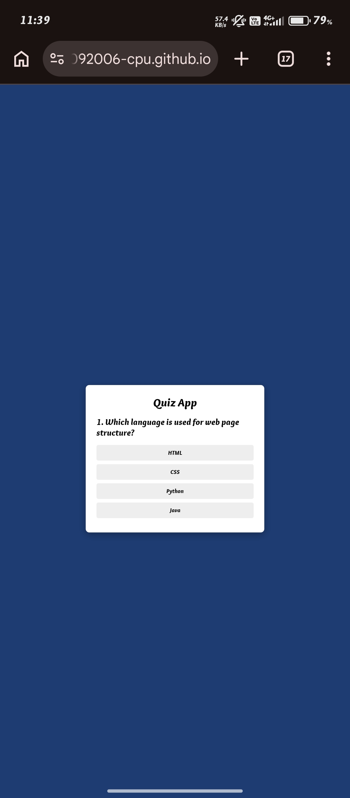

🧠 Quiz App

An interactive Quiz Application built using HTML, CSS, and JavaScript. The application provides a simple and engaging interface where users can answer quiz questions and navigate through them using the Next button.

🚀 Live Demo

https://jeyabharathy30092006-cpu.github.io/Quiz-App/

✨ Features
- 🧠 Interactive quiz questions
- ▶️ Next question navigation
- 🎯 Simple and user-friendly interface
- 📊 Quiz interaction
- 🎨 Clean and responsive design
- 📱 Mobile-friendly interface
- ⚡ Lightweight and fast

🛠️ Technologies Used
- HTML5 – Structure of the quiz application
- CSS3 – Styling and responsive design
- JavaScript – Quiz logic and user interactions

📂 Project Structure

Quiz-App
  * index.html
  * style.css
  * script.js
  * quiz.jpg
  * README.md

⚙️ How to Run
1. Clone the Repository
git clone:
https://github.com/jeyabharathy30092006-cpu/Quiz-App.git
2. Open the Project
Open the project folder in Visual Studio Code.
3. Run the Application
Open "index.html" in your web browser.

🎯 Project Objective

The main objective of this project is to develop an interactive quiz application while practicing frontend web development concepts such as:
- HTML page structure
- CSS styling
- JavaScript programming
- DOM manipulation
- Event handling
- Interactive user interfaces
- Responsive web design

🔮 Future Enhancements
- 🏆 Display final score
- ⏱️ Add quiz timer
- 📚 Add multiple quiz categories
- 🎚️ Add difficulty levels
- 🏅 Add leaderboard
- 💾 Store user scores
- 🔄 Add quiz restart option

📸 Screenshot

👩‍💻 Author

Jeya Bharathy

Computer Science and Engineering Student

🔗 Project Links

Live Demo:
https://jeyabharathy30092006-cpu.github.io/Quiz-App/

GitHub Repository:
https://github.com/jeyabharathy30092006-cpu/Quiz-App

⭐ Support

If you like this project, consider giving the repository a ⭐ on GitHub.
